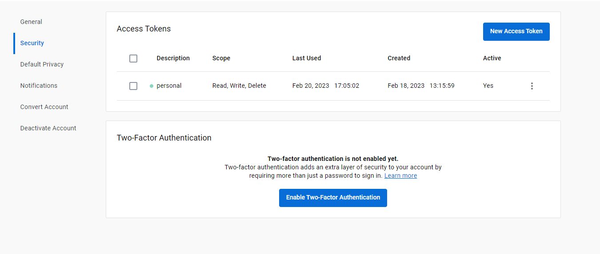
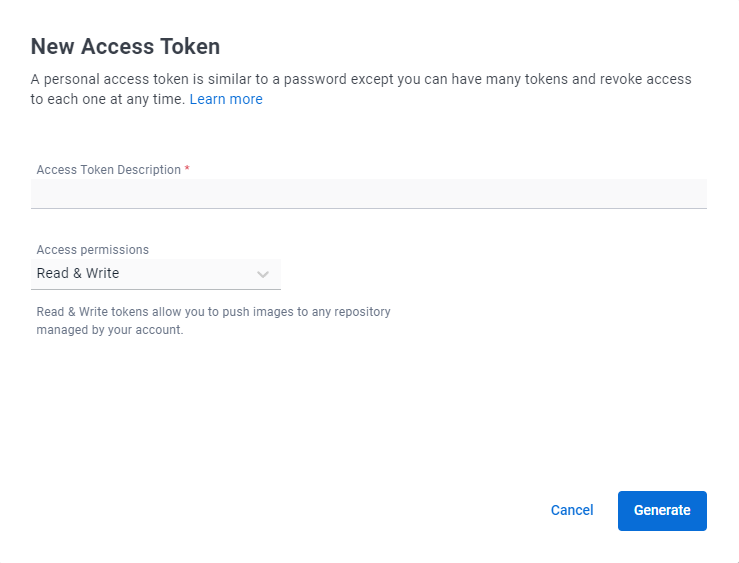
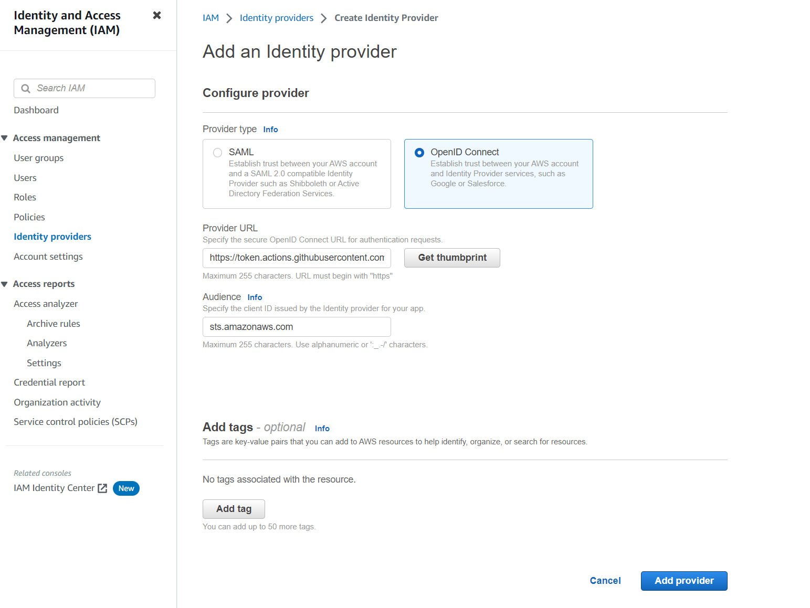
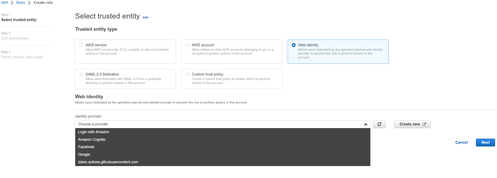
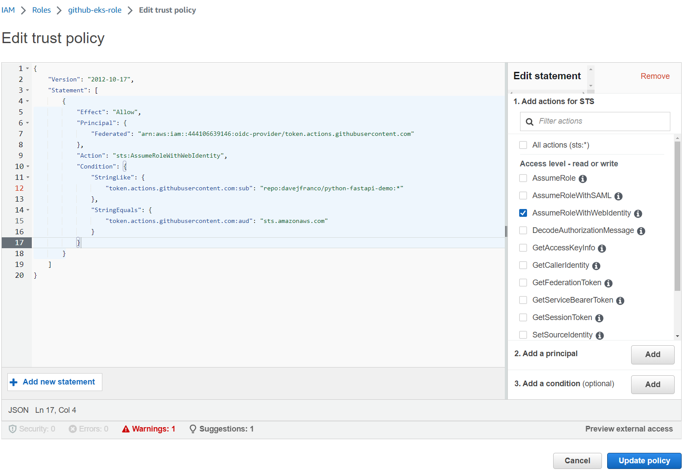
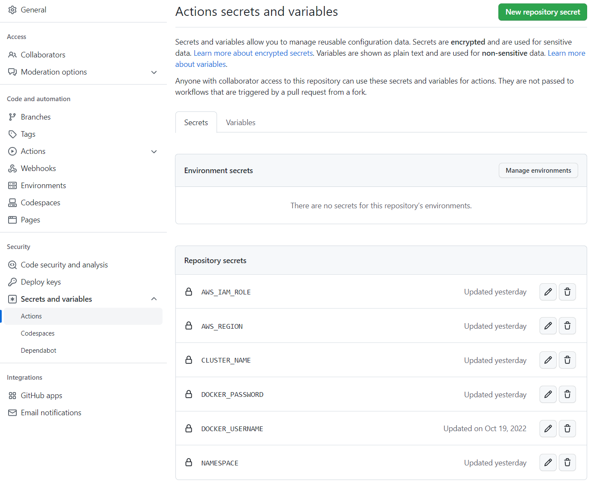

# Desplegar una aplicacion desde GitHub Actions a AWS EKS

En este tutorial vamos a demostrar como desplegar de forma segura una aplicación desde Github a través de GitHub Actions a un cluster de Kubernetes en AWS EKS. 

Nota: Este tutorial no cubrirá la creación de una aplicación de ejemplo ni el pipeline de CI/CD pero si como conectarnos con nuestros cluster de forma segura para desplegar nuestra aplicación. 


## pre-requisitos
- Tener una cuenta en AWS
- Tener una cuenta en GitHub
- Tener una cuenta en DockerHub
- Tener instalado [kubectl](https://kubernetes.io/docs/tasks/tools/)
- Tener instalado [eksctl](https://docs.aws.amazon.com/eks/latest/userguide/eksctl.html)
- Tener instalado [aws-cli](https://docs.aws.amazon.com/es_es/cli/latest/userguide/getting-started-install.html)


## Crear el cluster de Kubernetes en AWS EKS

La forma más rápida que podemos tener un cluster de EKS es usando el comando `eksctl`. En este mismo proyecto tenemos un tutorial de como hacerlo. Solo tendrás que crear la VPC previamente y ajustar el archivo de configuración según los valores de tu red.

Sino conoces como crear un vpc o usar eksctl puedes seguir el siguiente tutorial: [Tutorial de EKSCTL](../../kubernetes/eksctl/TUTORIAL.md)

Una vez ajustado el archivo de configuración, ejecutamos el siguiente comando:

```bash
eksctl create cluster -f cluster.yaml
```

Esto nos creará cluster de Kubernetes en AWS EKS. Una vez finalizado el proceso para conectarnos al cluster de Kubernetes ejecutamos el siguiente comando:

```bash
aws eks update-kubeconfig \
  --name [cluster_name] \
  --alias [cluster_name] \
  --region us-east-1
```

Una vez conectados al cluster de Kubernetes, podemos comprobar que el cluster está funcionando correctamente ejecutando el siguiente comando:

```bash
kubectl get nodes
```
## Configurar cluster

Antes de conectar a github con nuestro nuevo cluster haremos un par de ajustes en el cluster. Lo primero será crear un namespace para nuestra aplicación. Para ello ejecutamos el siguiente comando:

```bash
kuebctl create namespace app
```

y vamos a crear un secret para que nuestro cluster pueda conectarse a nuestro repositorio de DockerHub. Para ello ejecutamos el siguiente comando:

```bash
kubectl create secret docker-registry dockerhub \
  --docker-server=https://hub.docker.com  \
  --docker-username=[dockerhub_username] \
  --docker-password=[dockerhub_password] \
  --docker-email=[dockerhub_email] \
  --namespace=app
```

Si tenemos nuestra cuenta de dockerhub que es gratuita hacemos login en https://hub.docker.com/ y en la parte superior derecha hacemos click en el icono de usuario y seleccionamos `Account Settings`. En la sección `Security` podemos generar un nuevo token para usarlo como password.





El token generado lo usaremos como password en el comando anterior.

## Configurar aplicación ejemplo

`python-fastapi-demo` es una aplicación de ejemplo en la que tenemos una API REST que nos permite ver las tiendas con nombre y direccion, añadir tiendas, ver los productos de una tienda y algunas cosas más. Acá tienes dos opciones, puedes hacer "fork" de este repositorio o crear tu propio repositorio. El enlace al código puedes encontrarlo [aquí](github.com/davejfranco/python-fastapi-demo).

Te muestro un poco como funciona. Lo primero veamos el Dockerfile:

```dockerfile
FROM python:3.10.8-alpine

#app directory
WORKDIR /app
#demo user
ARG USER_ID=1000
ARG GROUP_ID=1000

RUN addgroup -g ${GROUP_ID} demo \
 && adduser -D demo -u ${USER_ID} -g demo -G demo -s /bin/sh

#copy files
COPY --chown=demo . /app/

#install depedencies
RUN apk add --no-cache --virtual .build-deps gcc libc-dev make \
    && pip install --no-cache-dir -r requirements.txt \
    && apk del .build-deps gcc libc-dev make

USER demo

#entrypoint
CMD ["uvicorn", "app.main:app", "--proxy-headers", "--host", "0.0.0.0", "--port", "8080"]
```

Como puedes ver este proyecto, esta hecho en python, utiliza una framework que se llama [FastAPI](https://fastapi.tiangolo.com/) y utiliza un servidor web que se llama [Uvicorn](https://www.uvicorn.org/). La imagen base es una imagen de python en alpine, añadimos un usuarios y grupo para que la aplicación no se ejecute como root; esto es la buena práctica. Copiamos los archivos de la aplicación y instalamos las dependencias. Por último ejecutamos la aplicación.

Luego tenemos el HELM Chart. Helm es un gestor de paquetes para Kubernetes. En este caso tenemos un chart que nos permite desplegar la aplicación en Kubernetes. Puedes encontrar el chart en la carpeta `chart`. Finalmente hay un directorio `.github/workflows` donde tenemos el pipeline de CI/CD. Este pipeline se encarga de hacer el build de la imagen, hacer push a DockerHub y desplegar la aplicación en Kubernetes usando helm.

Veamos el pipeline de CI/CD:

```yaml
name: CICD

on:
  push:
    branches:
      - master

permissions:
  id-token: write
  contents: read
  
jobs:
  ci:
    runs-on: ubuntu-latest
    steps:
      - name: Check out code
        uses: actions/checkout@v2
      
      - name: Install dependencies
        run: |
          pip3 install -r requirements.txt
      
      - name: Run unittests
        run: |
          pytest test/test.py 

      - name: docker build 
        run: |
          docker build -t ${{ secrets.DOCKER_USERNAME }}/python-fast-api:${{ github.sha }} .

      - name: docker login
        uses: docker/login-action@v2
        with:
          username: ${{ secrets.DOCKER_USERNAME }}
          password: ${{ secrets.DOCKER_PASSWORD }}
      
      - name: docker push 
        run: |
          docker push ${{ secrets.DOCKER_USERNAME }}/python-fast-api:${{ github.sha }}
      
    outputs:
        image_tag: ${{ github.sha }}

  cd:
    runs-on: ubuntu-latest
    needs: ci
    steps:    
      
      - name: Check out code
        uses: actions/checkout@v2
     
      - name: Authenticate in AWS
        uses: aws-actions/configure-aws-credentials@v1
        with:
          role-to-assume: ${{ secrets.AWS_IAM_ROLE }}
          role-duration-seconds: 1200
          role-session-name: GHA-${{ github.sha }}
          aws-region: ${{ secrets.AWS_REGION }}
      
      - name: Upgrade Helm Chart with latest image tag
        run: |
          aws eks update-kubeconfig --name $CLUSTER_NAME
          
          helm upgrade \
            python-fastapi chart/ \
            --install --wait \
            --values eks-values.yaml \
            --set image.tag=${{ needs.ci.outputs.image_tag }} \
            --namespace $NAMESPACE
        env:
          CLUSTER_NAME: ${{ secrets.CLUSTER_NAME }}
          NAMESPACE: ${{ secrets.NAMESPACE }}

      - name: Notify Successful
        run: |
          echo "Success!"
      
      - name: Notify Fail
        if: ${{ failure() }}
        run: |
          echo "The deployment has failed!"
```

En la primera parte, como todo buen CI vamos a instalar las dependencias de nuestra aplicación y ejecutar pruebas unitarias. Luego vamos a hacer el build de la imagen y hacer push a DockerHub. Podrás notar que en el build de la imagen estamos usando el tag `${{ github.sha }}`. Esto es para que cada vez que se haga un push a master se cree una nueva imagen con un tag diferente. Esto nos permite tener un control de versiones de nuestra aplicación. 

Además notarás que en la etapa de CI tenemos variables tipo secrets que corresponden al ``${{ secrets.DOCKER_USERNAME }}`` y ``${{ secrets.DOCKER_PASSWORD }}`` el cual pasaremos a la accion ``docker login`` para autenticarnos en DockerHub. Estas variables las vamos a configurar en la sección de secrets de nuestro repositorio.

Terminado esta etapa tenemos el CD que es donde nos conectamos a nuestro cluster para instalar el helm chart de nuestra aplicacion. Para esto vamos a usar la accion ``aws-actions/configure-aws-credentials@v1`` que nos permite autenticarnos en AWS usando un rol de IAM. Este rol de IAM debe tener permisos para poder hacer el update-kubeconfig y el upgrade del helm chart. Como puedes ver no estoy usando ``AWS_ACCESS_KEY_ID`` y ``AWS_SECRET_ACCESS_KEY``, esto es porque no es una buena práctica usar estas variables en un pipeline de CI/CD y es posible hacer esto porque podemos configurar el rol IAM y usar añadir a github como trusted entity. Para más información puedes ver [este enlace](https://docs.github.com/en/actions/deployment/security-hardening-your-deployments/configuring-openid-connect-in-amazon-web-services).


## Configurar acceso a AWS usando OIDC

Vamos a nuestra cuenta de AWS y lo primero que haremos es agregar a github como trusted entity. Para esto vamos a IAM y en la sección de entidades de confianza vamos a agregar a github.



En la sección de provider vamos a seleccionar ``OpenID Connect`` y en el provider URL ``https://token.actions.githubusercontent.com`` y en audience ``sts.amazonaws.com``. Luego damos click Get Thumbprint. Una vez listo le damos añadir.

Luego vamos a el IAM ROLE que nos permitirá acceder al cluster EKS. Nos vamos a IAM y en la sección de roles vamos a crear un rol.
 

 El tipo de entidad es ``Web Identity`` y el proveedor es el que recién creamos para Github y audiencia ``sts.amazonaws.com``. Luego damos click en siguiente para crear los permisos.

 Vamos a crear un politica; a continuación te dejo la politica que yo cree para este ejemplo. 

```json
{
    "Version": "2012-10-17",
    "Statement": [
        {
            "Sid": "VisualEditor0",
            "Effect": "Allow",
            "Action": [
                "eks:DescribeCluster",
                "eks:ListClusters"
            ],
            "Resource": "*"
        }
    ]
}
```
Le damos el nombre que queramos y damos click en siguiente. Luego damos click en crear rol.



Tenemos que tomar note del arn del rol porque esto lo necesitamos para configurar el pipeline de CI/CD.

## Configurar el pipeline de CI/CD
En tu repo vamos a la sección de secrets y vamos a crear las siguientes variables:



``AWS_IAM_ROLE`` El arn del rol que creamos en el paso anterior. ``AWS_REGION`` es la region en donde se encuentra nuestro cluster, ``DOCKER_USERNAME`` y ``DOCKER_PASSWORD`` son las credenciales de DockerHub. ``CLUSTER_NAME`` es el nombre del cluster EKS y ``NAMESPACE`` es el namespace donde se va a instalar el helm chart.


## Mapear el rol de IAM con el cluster EKS

Antes de continuar debemos mappear el rol de IAM que creamos en el paso anterior con el cluster EKS. Para esto vamos de nuevo con eksctl

```bash
eksctl create iamidentitymapping \
    --cluster $CLUSTER_NAME \
    --arn $AWS_IAM_ROLE \
    --group system:masters \
    --username admin
```

Si todo salió bien, para ver si el rol de IAM se mapeo correctamente podemos ejecutar el siguiente comando:

```bash
eksctl get iamidentitymapping \
  --cluster $CLUSTER_NAME \
  --region $AWS_REGION
```

Debes ver algo como esto:
```bash
ARN                                                                                             USERNAME                                GROUPS      ACCOUNT
arn:aws:iam::444106639146:role/eksctl-tutorial-eks-nodegroup-man-NodeInstanceRole-1RWBZI0EUBV0Q system:node:{{EC2PrivateDNSName}}       system:bootstrappers,system:nodes
arn:aws:iam::444106639146:role/github-eks-role                                                  admin                                   system:masters
```

## Probemos el pipeline

Ahora que ya tenemos todo configurado vamos a hacer un push a master para ver si todo funciona correctamente. 

```bash
git add -A
git commit -m "add ci/cd pipeline"
git push origin master
```

Nos vamos a la sección de actions y podemos ver que se está ejecutando el pipeline.

Si todo salió bien, podemos ver que el pipeline se ejecutó correctamente y que se hizo el deploy de nuestra aplicación. Podemos ver que nuesta aplicación está corriendo en el cluster EKS con el siguiente comando:
  
```bash 
kubectl get pods -n app
```


