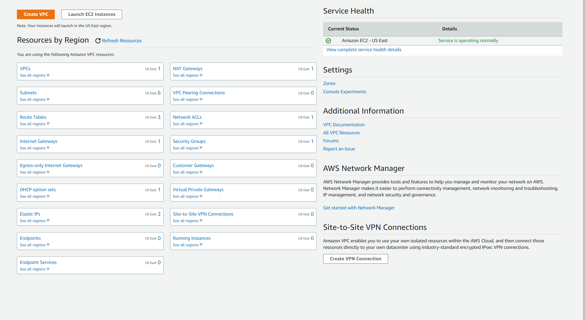
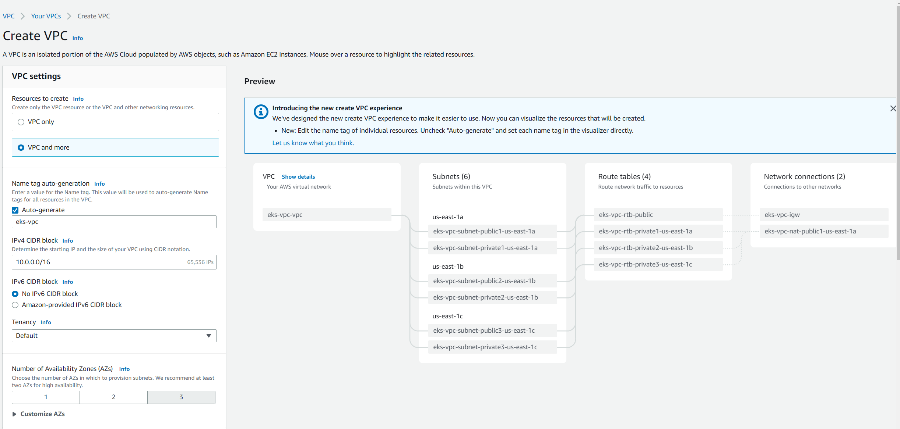
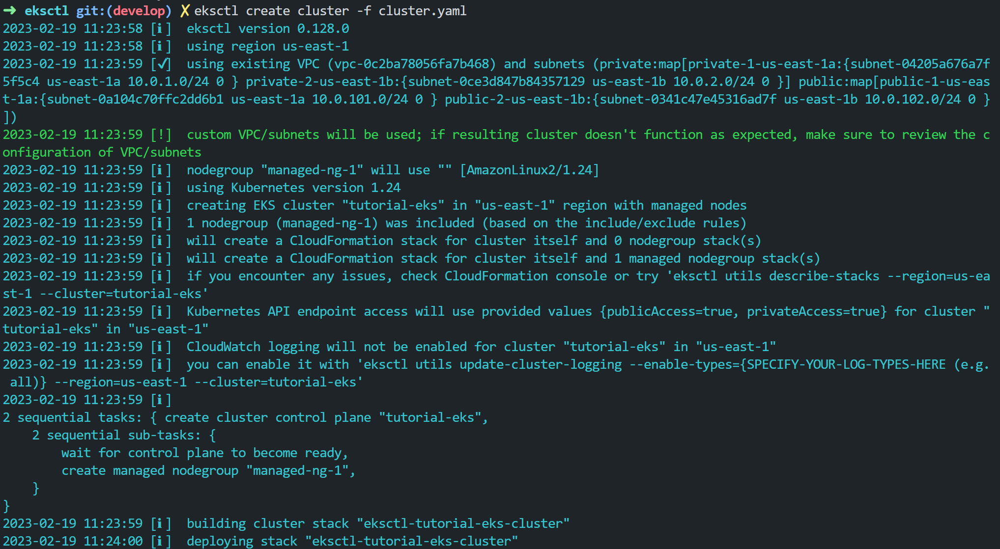

# Cluster Kubernetes con eksctl

En este tutorial vamos a crear un cluster de Kubernetes en AWS con eksctl. Puedes ver el video del tutorial [aquí](https://www.youtube.com/watch?v=33ccYsS_RSw&t=5s&ab_channel=DaveOps)

## ¿Que es eksctl?

eksctl es una herramienta de línea de comandos para crear clusters de Kubernetes en AWS. Es una herramienta de código abierto escrita en Go y publicada bajo la licencia Apache 2.0.

## Instalación

### Linux

La manera más fácil de instalar eksctl en Linux es mediante el comando curl. El comando curl descarga el archivo comprimido de la última versión de eksctl y lo descomprime en el directorio /tmp. Luego mueve el archivo descomprimido a /usr/local/bin, que es un directorio en el PATH de tu sistema.

```bash
curl --silent --location "https://github.com/weaveworks/eksctl/releases/latest/download/eksctl_$(uname -s)_amd64.tar.gz" | tar xz -C /tmp
sudo mv /tmp/eksctl /usr/local/bin
```	

## Pre-requisitos

Vamos a necesitar instalar kubectl y aws-cli. 

### Instalación de kubectl

Para instalar kubectl 
  
```bash
curl -LO "https://dl.k8s.io/release/$(curl -L -s https://dl.k8s.io/release/stable.txt)/bin/linux/amd64/kubectl"
```
para mayor información sobre la instalación de kubectl puedes consultar la documentación oficial de kubernetes [aquí](https://kubernetes.io/docs/tasks/tools/install-kubectl-linux/)

### Instalación de aws-cli

Para instalar aws-cli

```bash
curl "https://awscli.amazonaws.com/awscli-exe-linux-x86_64.zip" -o "awscliv2.zip"
unzip awscliv2.zip
sudo ./aws/install
```
para mayor información sobre la instalación de aws-cli puedes consultar la documentación oficial de aws [aquí](https://docs.aws.amazon.com/cli/latest/userguide/getting-started-install.html)

También necesitaremos una cuenta de AWS con acceso, una vez tengamos la cuenta de AWS, hay que configurar el acceso desde aws-cli. Para ello, ejecutamos el comando aws configure y nos pedirá que introduzcamos la clave de acceso, la clave secreta y la región. 

```bash
aws configure
```
Puedes encontrar la documentación oficial de aws [aquí](https://docs.aws.amazon.com/es_es/cli/latest/userguide/cli-chap-configure.html)

## Creación de un cluster

La manera más fácil de crear un cluster es mediante el comando eksctl create cluster. Este comando crea un cluster de Kubernetes con el nombre especificado y la versión especificada. 

```bash
eksctl create cluster --name my-cluster --version 1.24
```

Sin embargo vamos a crear un cluster con un archivo de configuración. EL ejemplo estan en esta misma ruta.

## Creemos nuestra VPC

Iremos a la consola de AWS y crearemos una VPC con el nombre que queramos. En la consala vamos al buscador buscamos VPC. Una vez dentro de VPC, vamos a crear una VPC.



Usaremos "VPC and more" de modo que nos cree las subnets y demas componentes para que nuestra red funcione adecuadamente. Luego podemos crear nuestra vpc con el nombre que queramos pero yo usare "eks-vpc" 




## Creación de un cluster con un archivo de configuración

Vamos a crear un cluster con un archivo de configuración. Para ello, vamos a crear un archivo llamado cluster.yaml con el siguiente contenido:

```yaml
---
apiVersion: eksctl.io/v1alpha5
kind: ClusterConfig

metadata:
  name: tutorial-eks
  region: us-east-1
  version: '1.24'
```	

este archivo esta adjunto en esta misma ruta.

La seccion ```apiVersion``` y ```kind``` son obligatorias. La seccion ```metadata``` es la seccion que contiene la información del cluster. En este caso, el nombre del cluster es tutorial-eks, la región es us-east-1 y la versión es 1.24.

Luego tenemos la seccion de la vpc
  
```yaml
vpc:
  id: "vpc-0c2ba78056fa7b468"
  clusterEndpoints:
    publicAccess:  true
    privateAccess: true
  subnets:
    public:
      public-1-us-east-1a:
        id: "subnet-0a104c70ffc2dd6b1"
      public-2-us-east-1b:
        id: "subnet-0341c47e45316ad7f"
    private:
      private-1-us-east-1a:
        id: "subnet-04205a676a7f5f5c4"
      private-2-us-east-1b:
        id: "subnet-0ce3d847b84357129"  
```
vamos a necesitar el id de la vpc que hemos creado en el paso anterior. Para ello, vamos a la consola de AWS y vamos a la seccion de VPC. Una vez dentro de VPC, vamos a la seccion de VPC y seleccionamos la VPC que hemos creado. Una vez dentro de la VPC, vamos a la seccion de "Identificador de VPC" y copiamos el id de la VPC.

En la seccion de clusterEndpoints, tenemos dos opciones, publicAccess y privateAccess. PublicAccess es para que el cluster sea accesible desde internet y privateAccess es para que el cluster sea accesible desde la red privada. En este caso, vamos a dejar las dos opciones a true.

Finalmente tenemos la seccion de subnets que es donde vamos a indicar las subnets que vamos a usar. En este caso, vamos a usar las subnets que hemos creado en el paso anterior. Para ello, vamos a la consola de AWS y vamos a la seccion de VPC. Una vez dentro de VPC, vamos a la seccion de Subnets y seleccionamos las subnets que hemos creado. Una vez dentro de la subnet, vamos a la seccion de "Identificador de subred" y copiamos el id de la subred.

En la seccion de managedNodeGroups, tenemos la configuración de los nodos que vamos a crear. En este caso, vamos a crear un nodo con el nombre managed-ng-1, el tipo de instancia es t3.small, la red privada es true, el tamaño minimo es 1, el tamaño maximo es 2, el tamaño deseado es 1, el tamaño del volumen es 30 GB, el label es node-group-type y el tag es nodegroup-role.

```yaml
managedNodeGroups:
  - name: managed-ng-1
    instanceType: t3.small
    privateNetworking: true
    minSize: 1
    maxSize: 2
    desiredCapacity: 1
    volumeSize: 30
    labels: {node-group-type: managed}
    tags:
      nodegroup-role: worker  
```
Este archivo al completo esta adjunto en esta misma ruta.

Una vez tenemos el archivo, vamos a crear el cluster con el siguiente comando:

```bash
eksctl create cluster -f cluster.yaml
```

Veremos esto en la terminal si todo esta bien configurado.



Esto usara CloudFormation para crear los recursos necesarios para nuestro cluster. Vamos a generar el kubeconfig para poder acceder al cluster. Para ello, ejecutamos el siguiente comando:

```bash
aws eks --region us-east-1 \
  update-kubeconfig \
  --name tutorial-eks \
  --alias tutorial-eks
```

Una vez tenemos el kubeconfig, podemos comprobar que el cluster esta funcionando correctamente con el siguiente comando:

```bash
kubectl get nodes
```

Nota: Si has seguido el tutorial recuerda luego eliminar los recursos que haz creado, con eksctl para eliminar el cluster ejecuta el siguiente comando:

```bash
eksctl delete cluster --name tutorial-eks
```

La vpc debes eliminarla manualmente desde la consola de AWS.


Recuerda que si te gusta mi contenido puedes seguirme en mis redes sociales.

- [youtube](https://www.youtube.com/c/DaveOps)
- [Instagram](https://www.instagram.com/thedaveops/)
- [Twitter](https://twitter.com/davejfranco)
